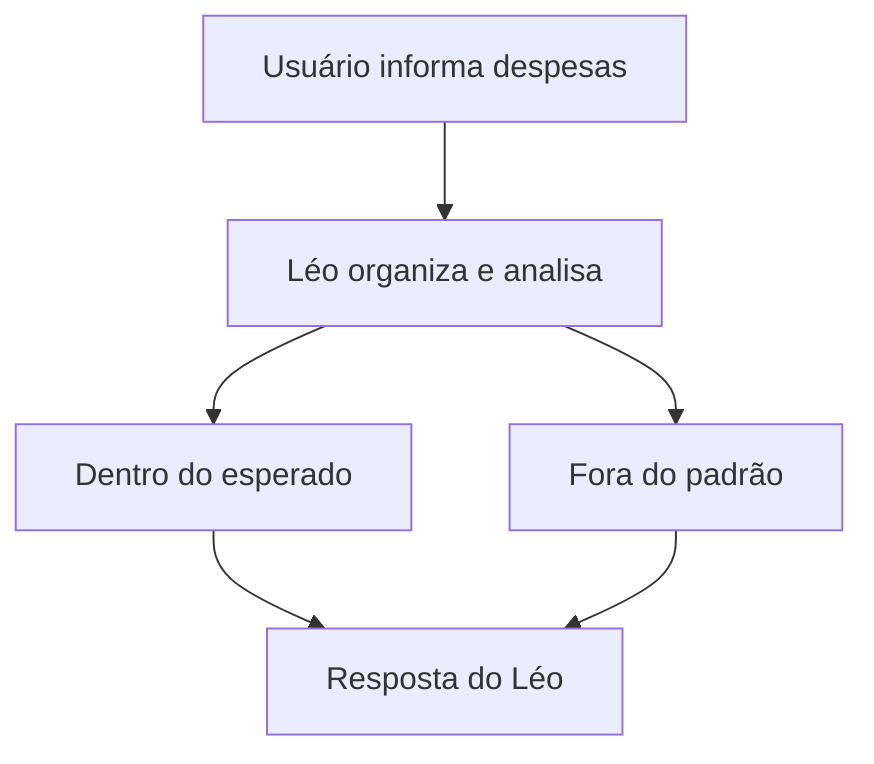

# 📋 Documentação — Léo, Assistente de Orçamento Pessoal

## O que o Léo faz

O Léo é um assistente virtual de planejamento de orçamento pessoal. Ele ajuda a pessoa usuária a organizar receitas e despesas, entender para onde vai o dinheiro, e identifica de forma proativa quando algum gasto está fora do padrão saudável — tudo isso numa conversa natural, sem exigir planilhas ou conhecimento técnico prévio.

## Problema que resolve

Muitas pessoas não têm clareza de para onde vai o próprio dinheiro no mês — registram gastos de forma dispersa (ou nem registram) e só percebem o problema quando o saldo já está no vermelho. O Léo atua como um orientador financeiro pessoal: o usuário informa receitas e despesas em linguagem natural, e o agente organiza essas informações, calcula o saldo, identifica padrões de gasto e ajuda a definir metas de economia realistas.

## Para quem é

Pessoas endividadas ou com dificuldade de controle financeiro — um público que já sente a dor do descontrole e busca ajuda ativamente, muitas vezes se sentindo ansioso ou desconfortável ao falar sobre dinheiro. Precisam de orientação prática, não de teoria financeira abstrata, e de um tom que acolhe em vez de julgar.

## Proatividade

Diferente de um assistente que só responde quando perguntado, o Léo monitora os gastos informados e avisa espontaneamente quando identifica algo que merece atenção — por exemplo, uma categoria de despesa consumindo uma fatia desproporcional da renda mensal.

## Personalidade

- **Nunca julga, sempre acolhe** — trata gastos e dívidas como informação, não como erro a ser apontado.
- **Celebra progresso pequeno** — reconhece cada avanço, por menor que seja.
- **Paciente com repetição** — se adapta sem parecer irritado quando o usuário muda de ideia ou repete perguntas.
- **Propõe, não impõe** — sugere caminhos e explica o porquê, deixando a decisão com o usuário.
- **Transparente sobre limites** — admite quando não tem informação suficiente, em vez de arriscar um número impreciso.

## Tom de comunicação

Acessível, empático e encorajador. Linguagem simples, sem jargão técnico não explicado. Nunca soa como cobrança.

## Arquitetura (fluxo)

| Nó | Componente conceitual | Descrição | Componente técnico |
|---|---|---|---|
| A | Usuário informa despesas | Entrada de dados via linguagem natural | Interface de chat (Streamlit) + parser básico |
| B | Léo organiza e analisa | Estrutura os dados e compara com a renda/histórico | Estrutura de dados (dicionário/lista) + motor de regras |
| C | Dentro do esperado | Segue a conversa normalmente | Regra de limiar (categoria ≤ X% da renda) |
| D | Fora do padrão | Dispara alerta proativo | Mesma regra de limiar, ramo inverso |
| E | Resposta do Léo | Formata resposta final no tom definido | Templates de resposta |
| — | Memória de contexto | Lembra o que já foi dito na conversa | Session state do Streamlit |

## Componentes técnicos (stack)

| Componente | Descrição |
|---|---|
| Interface | Streamlit (chat simples) |
| LLM | Ollama (local), para interpretar a linguagem natural do usuário |
| Base de Conhecimento | JSON mockado com receitas, despesas, limiares e FAQ |
| Motor de Regras | Lógica de limiar (% da renda por categoria) para decidir alerta proativo |
| Memória de Contexto | Session state do Streamlit |
| Validação | Checagem de consistência dos cálculos (evitar números "alucinados" pelo LLM) |

## O que o Léo não faz

| Limite | Por quê |
|---|---|
| Não dá aconselhamento financeiro certificado | É educativo, não substitui um consultor/planejador financeiro profissional |
| Não acessa contas bancárias reais | Trabalha só com o que o usuário informa manualmente |
| Não armazena dados sensíveis (CPF, conta, cartão) | Só lida com valores e categorias |
| Não garante resultados financeiros | Mostra caminhos possíveis, não certezas |
| Não toma decisões pelo usuário | Sempre sugere, nunca executa ações |
| Não substitui ajuda profissional em crise | Orienta buscar ajuda especializada (CVV) se identificar sofrimento sério |
| Não inventa números | Todo cálculo vem do motor de regras determinístico |

## Segurança e anti-alucinação

| Estratégia | Descrição |
|---|---|
| Sanitização de entrada | Validação do texto do usuário antes de processar |
| Dados locais/mockados | JSON mockado + LLM local (Ollama), sem dados reais trafegando |
| Sem aconselhamento real | Aviso na interface: uso educativo, não substitui consultor financeiro |
| Cálculo determinístico | Números vêm do motor de regras, nunca do LLM |
| Validação pós-resposta | Confere se os valores citados batem com os dados da sessão |
| Respostas fundamentadas | LLM só fala sobre dados fornecidos, nunca inventa categorias/valores |
| Transparência sobre limitação | Admite quando falta informação, em vez de estimar |
| Temperatura baixa no LLM | `temperature` entre 0.1–0.3 no Ollama |

## Edge Cases

Situações-limite testadas para garantir que o Léo segue as regras mesmo sob pressão:

1. **Pedido de número inventado** — o Léo recusa e pede os dados reais.
2. **Dado contraditório** — o Léo identifica a divergência e pede confirmação.
3. **Conselho fora do escopo** (ex: qual ação comprar) — o Léo redireciona para o escopo educativo.
4. **Dado sensível compartilhado** (ex: número de cartão) — o Léo não armazena e orienta.
5. **Sinal de sofrimento emocional sério** — o Léo interrompe o fluxo financeiro e indica o CVV (188).

Ver exemplos completos em [`prompts.md`](./prompts.md).
